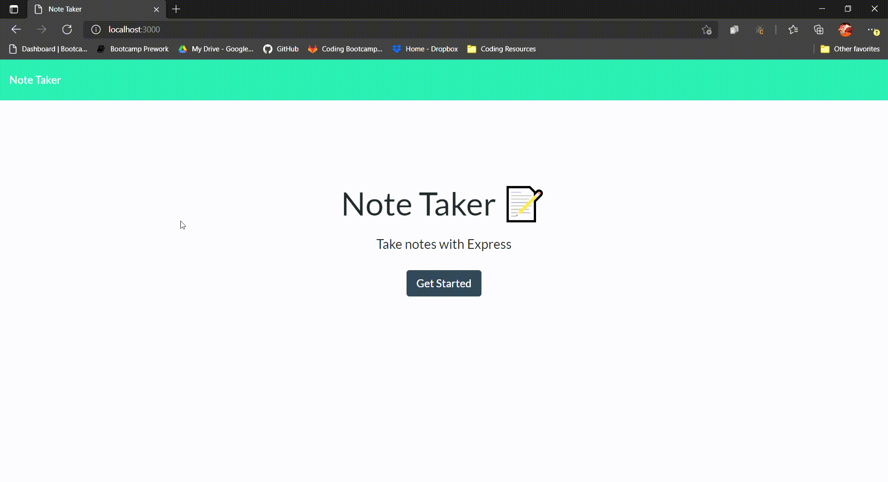

# Note Taker

 ## Description

 An application that can write and save notes using an Express.js back end.

  ## Table of Contents
  
  * [Installation](#installation)
  
  * [Usage](#usage)
  
  * [License](#license)

  * [Tests](#tests)
  
  * [Questions](#questions)
  
  ## Installation
  
  To install necessary dependencies, run the following command: "npm i". 
  
  
  ## Usage
  
  

  

  
  ## License
    
    This application is licensed under the MIT license.
    

  ## Tests
  
  There are no tests for this application.
  
      
  ## Questions  

  If you have any questions about the repo or application, open an issue or contact me directly at sample. More of my work can be found at [My Github](https://github.com/brob92993).

  [Note Taker Repository](https://github.com/brob92993/NoteTaker.git)

  [Live Website](https://intelligent-gerard-95399.herokuapp.com/)